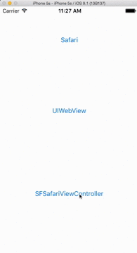

## Open a Browser
Often you may need to launch a website or additiona web content from your application such as showing a privacy policy or visiting an external blog. That is where OpenBrowser comes in and is fully optimzed to take advantage of Chrome Custom Tabs and SafariWebViewController to keep your users in your app.

```csharp
/// <summary>
/// Open a browser to a specific url
/// </summary>
/// <param name="url">Url to open</param>
/// <param name="options">Platform specific options</param>
/// <returns>awaitable Task</returns>
Task OpenBrowser(string url, BrowserOptions options = null);
```

Example:

```csharp
public void OpenBlog()
{
    if(!CrossShare.IsSupported)
        return;

    CrossShare.Current.OpenBrowser("http://motzcod.es");
}
```


### OS Specific Options
You can set a few device specific options by passing in BrowserOptions. Passing in null uses standard defaults.

```csharp
/// <summary>
/// Platform specific Browser Options
/// </summary>
public class BrowserOptions
{
    /// <summary>
    /// iOS: Gets or sets to use the SFSafariWebViewController on iOS 9+ (recommended).
    /// Default is true.
    /// </summary>
    public bool UseSafariWebViewController { get; set; } = true;
    /// <summary>
    /// iOS: Gets or sets to use reader mode (good for markdown files).
    /// Default is false.
    /// </summary>
    public bool UseSafariReaderMode { get; set; } = false;
        
    /// <summary>
    /// iOS: Gets or sets the color to tint the background of the navigation bar and the toolbar (iOS 10+ only).
    /// If null (default) the default color will be used.
    /// </summary>
    public ShareColor SafariBarTintColor { get; set; } = null;
    /// <summary>
    /// iOS: Gets or sets the color to tint the control buttons on the navigation bar and the toolbar (iOS 10+ only).
    /// If null (default) the default color will be used.
    /// </summary>
    public ShareColor SafariControlTintColor { get; set; } = null;

    /// <summary>
    /// Android: Gets or sets to display title as well as url in chrome custom tabs.
    /// Default is true
    /// </summary>
    public bool ChromeShowTitle { get; set; } = true;
    /// <summary>
    /// Android: Gets or sets the toolbar color of the chrome custom tabs.
    /// If null (default) the default color will be used.
    /// </summary>
    public ShareColor ChromeToolbarColor { get; set; } = null;
}
  ```


  Example:

```csharp
public void OpenBlog()
{
    if(!CrossShare.IsSupported)
        return true;

    var color =  new ShareColor
        {
            A = 255,
            R = 72,
            G = 98,
            B = 163
        };

    var options = new BrowserOptions
        {
            ChromeShowTitle = true,
            ChromeToolbarColor = color,
            SafariBarTintColor = color,
            SafariControlTintColor = color,
            UseSafariReaderMode = false,
            UseSafariWebViewController = true
        };

   CrossShare.Current.OpenBrowser("http://motzcod.es", options);
}
```

#### Android: Chrome Custom Tabs
[Chrome Custom Tabs](https://developer.chrome.com/multidevice/android/customtabs) give apps more control over their web experience, and make transitions between native and web content more seemless without having to resort to a WebView. We will attempte to use Chrome Custom Tabs in all scenarios, but will fall back to launching the browser when necessary.

This also gives your app really great performance:


#### iOS: SFSafariWebViewController
[SFSafariViewController](https://blog.xamarin.com/keep-users-engaged-with-ios-9s-sfsafariviewcontroller/) gives you a whole new way to display web content to users without having to navigate away from your application or roll your own complex web view.




<= Back to [Table of Contents](README.md)